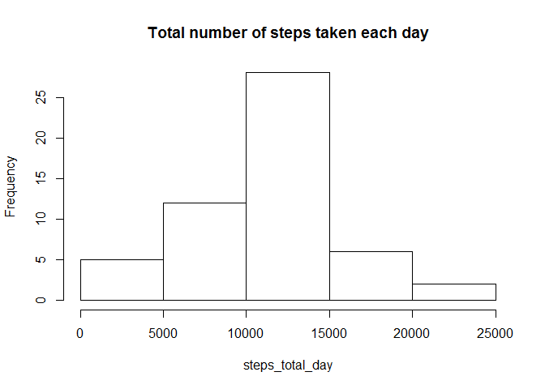
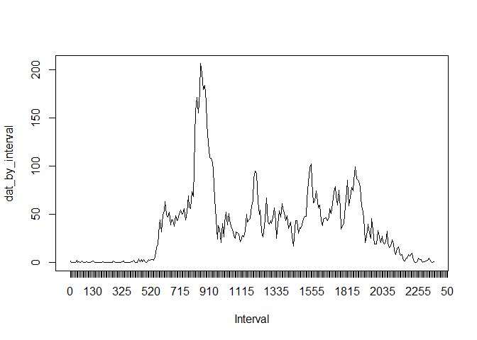
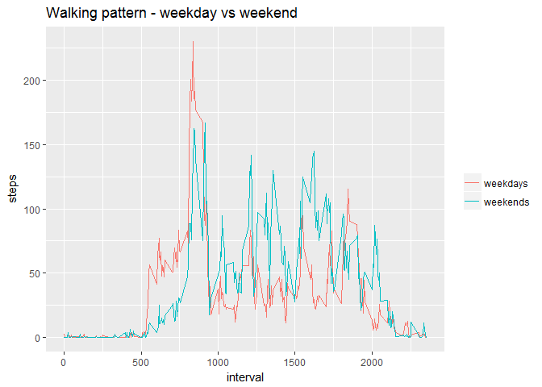

# Reproducible Research: Peer Assessment 1


## Loading and preprocessing the data

```r
setwd("C:\\Users\\Chengde\\Desktop\\Data Science JHU\\Course5\\Week2")
dat <- read.csv("activity.csv")
```


## What is mean total number of steps taken per day?
Removing missing values of the dataset.

```r
dat_tidy <- dat[!is.na(dat$steps),]
```
Calculating the total number of steps taken per day.

```r
steps_total_day <- tapply(dat_tidy$steps, dat_tidy$date, FUN = 'sum')
steps_total_day <- steps_total_day[!is.na(steps_total_day)]
```
Histogram of the total number of steps taken each day.

```r
hist(steps_total_day, main= "Total number of steps taken each day")
```

<!-- -->

Mean and median of the total number of steps taken each day.

```r
median(steps_total_day)
```

```
## [1] 10765
```

```r
mean(steps_total_day)
```

```
## [1] 10766.19
```


## What is the average daily activity pattern?

```r
dat_by_interval <- tapply(dat_tidy$steps, dat_tidy$interval, FUN = 'mean')
plot(dat_by_interval, type="l", xlab = "Interval", xaxt = "n")
axis(1, at = 1:length(dat_tidy$interval), labels=dat_tidy$interval)
```

<!-- -->

```r
names(which.max(dat_by_interval))
```

```
## [1] "835"
```
As shown in the result, on average the the time interval of 835th minute contains the maximum number of stpes.


## Imputing missing values
Calculating the total number of missing values in the dataset.

```r
nas <- is.na(dat$steps)
sum(nas)
```

```
## [1] 2304
```

Create a new dataset called 'dat_imputed', with the missing values replaced by the mean of 5-minute interval.

```r
ave_steps <- dat_by_interval[as.character(dat$interval)]
dat_imputed <- dat
dat_imputed$steps[nas] <- ave_steps[nas]
```
Histogram, mean, and median of the total number of steps taken each day.

```r
steps_total_day_imputed <- tapply(dat_imputed$steps, dat_imputed$date, FUN = 'sum')
hist(steps_total_day_imputed, main = "Total number of steps taken each day", xlab = "Number of steps")
```

<!-- -->

```r
median(steps_total_day_imputed)
```

```
## [1] 10766.19
```

```r
mean(steps_total_day_imputed)
```

```
## [1] 10766.19
```

```r
length(steps_total_day_imputed)
```

```
## [1] 61
```
Imputing the missing data increases the overall number of days that has the same range of steps taken each day.


## Are there differences in activity patterns between weekdays and weekends?


```r
w <- weekdays(as.Date(dat_imputed$date))
isweekend <- w=="Saturday" | w=="Sunday"
dat_tmp <- split(dat_imputed, isweekend)
weekday <- dat_tmp[[1]]
weekend <- dat_tmp[[2]]

weekday_pattern <- tapply(weekday$steps, weekday$interval, FUN = 'mean')
weekend_pattern <- tapply(weekend$steps, weekend$interval, FUN = 'mean')


df_weekday <- as.data.frame(weekday_pattern)
df_weekend <- as.data.frame(weekend_pattern)
matr <- cbind(unlist(df_weekday), unlist(df_weekend))
matr <- cbind(as.numeric(unlist(rownames(df_weekday))), matr)
dat_pattern <- as.data.frame(matr)
colnames(dat_pattern) <- c("interval", "weekdays", "weekends")

library(ggplot2)
library(reshape2)

data_long <- melt(dat_pattern, id="interval")
ggplot(data=data_long, aes(x=interval, y=value, group = variable, colour=variable)) + 
  geom_line() + ylab("steps") + 
  labs(title="Walking pattern - weekday vs weekend") +
  theme(legend.title=element_blank())
```

<!-- -->

As shown in the plot, the walking pattern of weekdays and weekends are different in details, but matching in big picture.
